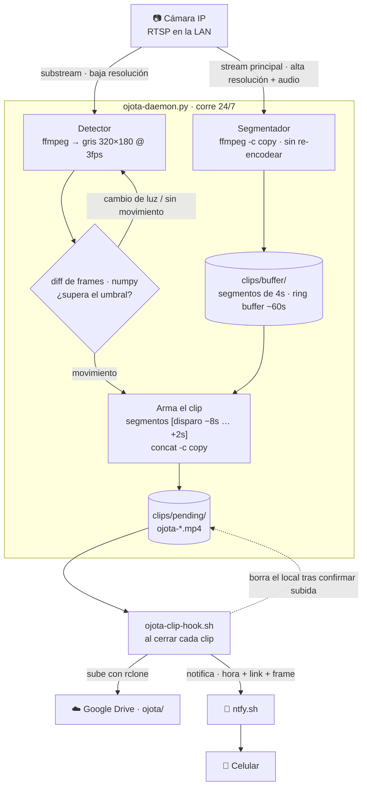

# ojota


Vigilancia de una cámara IP en la LAN: detecta movimiento, graba un clip con
pre-captura, lo sube a Google Drive, borra el local y avisa al celular.
Pensado para correr 24/7 en una Mac.

Alternativa casera al abono de grabación en la nube de la cámara: pre-captura,
audio y control total del pipeline.

---

## Cómo funciona

Dos conexiones RTSP a la misma cámara, cada una con un rol:



- **El segmentador graba siempre**, haya movimiento o no. Por eso la
  pre-captura es casi gratis: el pasado ya está en disco, al detectar
  solo se juntan los pedazos que corresponden.
- **La detección** corre sobre el substream de baja resolución, en gris y
  a 3 fps: barata en CPU (~2-3% de un núcleo en total).
- **Dispara** cuando N frames seguidos (`MOTION_MIN_FRAMES`) superan un
  umbral de píxeles cambiados (`MOTION_AREA_PCT`). Un cambio de casi toda
  la imagen (`LIGHT_CHANGE_PCT`) se toma como cambio de luz y se ignora.
- **Perfiles** `casa` / `afuera`: el daemon corre siempre; el perfil cambia
  ROI y si las notificaciones de movimiento suenan o no. Bootea en `afuera`.

---

## Requisitos

- macOS (desarrollado y probado en un Mac con Intel)
- [Homebrew](https://brew.sh)
- `ffmpeg` — `brew install ffmpeg`
- `rclone` — `brew install rclone` *(Etapa 3)*
- Python 3.11+ (para el venv)
- Una cámara con RTSP accesible en la LAN, con IP fija o reservada por DHCP

---

## Setup inicial

```sh
# 1. Ubicar el repo en ~/ojota
git clone <repo> ~/ojota && cd ~/ojota

# 2. Entorno Python aislado
python3 -m venv .venv
.venv/bin/pip install -r requirements.txt

# 3. Config con secretos (queda fuera de git)
cp config/ojota.conf.example config/ojota.conf
chmod 600 config/ojota.conf

# 4. Editar config/ojota.conf:
#    - RTSP_URL / RTSP_SUBSTREAM_URL  (usuario, pass e IP de tu cámara)
#    - NTFY_TOPIC   ->  generar uno:  echo "ojota-$(openssl rand -hex 20)"
#    - revisar el resto de parámetros (ver tabla abajo)

# 5. Probar la detección en vivo y calibrar umbrales
.venv/bin/python bin/ojota-tune.py           # pasá por delante de la cámara

# 6. rclone / Google Drive   -> ver Etapa 3 (pendiente)
# 7. Instalar el LaunchDaemon -> ver Etapa 5 (pendiente)
```

### Encontrar el substream de tu cámara

```sh
ffprobe -v error -rtsp_transport tcp -i "rtsp://user:pass@IP:554/PATH" \
  -show_entries stream=width,height -of csv=p=0
```

Probá rutas comunes (`/Streaming/Channels/102`, `/h264_stream2`, etc.) hasta
encontrar una de menor resolución. Si no hay, dejá `RTSP_SUBSTREAM_URL` vacío
y se usa el stream principal también para detectar.

---

## Configuración

Todo en `config/ojota.conf` (formato `KEY=VALUE`, lo leen bash y Python).

| Parámetro | Default | Qué hace |
|---|---|---|
| `RTSP_URL` | — | Stream principal (grabación) |
| `RTSP_SUBSTREAM_URL` | — | Stream de baja resolución (detección) |
| `DETECT_FPS` | 3 | Frames/s a analizar |
| `DETECT_WIDTH` | 320 | Ancho al que se reduce antes de comparar |
| `PIXEL_DELTA` | 18 | Cuánto (0-255) cambia un píxel para "contar" |
| `MOTION_AREA_PCT` | 1.5 | % de píxeles cambiados para disparar |
| `MOTION_MIN_FRAMES` | 3 | Frames seguidos sobre el umbral para disparar |
| `LIGHT_CHANGE_PCT` | 70 | Cambio ≥ esto = cambio de luz, se ignora |
| `DETECT_WARMUP_SECONDS` | 15 | Ignorar movimiento los primeros N s tras conectar |
| `DETECT_ROI` | `0,0,1,1` | Zona de detección (izq,arr,der,ab en fracciones). No recorta el video. |
| `SEGMENT_SECONDS` | 4 | Tamaño de cada segmento del ring buffer |
| `PRECAPTURE_SECONDS` | 8 | Segundos antes del evento a incluir |
| `POSTCAPTURE_SECONDS` | 10 | Seguir grabando tras el último movimiento |
| `BUFFER_RETENTION_SECONDS` | 60 | Historial a mantener en el ring buffer |
| `DEFAULT_PROFILE` | `afuera` | Perfil al bootear |
| `NTFY_TOPIC` | — | Topic de ntfy.sh (secreto, generar aleatorio) |
| `NOTIFY_SILENCE_MINUTES` | 5 | Ventana anti-spam de notificaciones |
| `CAMERA_DOWN_ALERT_MINUTES` | 5 | Alerta si la cámara no responde por N min |
| `RCLONE_REMOTE` / `RCLONE_PATH` | `gdrive` / `ojota` | Destino en Drive |
| `RETENTION_DAYS` | 30 | Borrar de Drive clips más viejos que esto |

---

## Operación

```sh
# Calibrar detección (no graba nada, solo muestra % de cambio por frame)
.venv/bin/python bin/ojota-tune.py [--main] [--seconds=N]

# Correr el daemon a mano (para probar)
.venv/bin/python bin/ojota-daemon.py

# Cambiar de perfil
echo casa   > config/profile     # en casa: notificaciones en silencio
echo afuera > config/profile     # armado

# Como servicio -> ver Etapa 5 (pendiente): start / stop / status
```

---

## Diagnóstico

- **Log**: `logs/ojota.log` (rota a 2 MB, 5 archivos).
- **No detecta / detecta de más**: correr `ojota-tune.py`, mirar los % con
  y sin movimiento, ajustar `PIXEL_DELTA` y `MOTION_AREA_PCT`.
- **Falsos positivos por luz**: bajar `LIGHT_CHANGE_PCT` o acotar `DETECT_ROI`.
- **La cámara se cae**: el daemon reintenta con backoff exponencial y
  dispara una alerta si no hay frames por `CAMERA_DOWN_ALERT_MINUTES`.
- **Clip cortado**: subir `POSTCAPTURE_SECONDS` / `PRECAPTURE_SECONDS`.

---

## Estado del proyecto

| Etapa | Estado |
|---|---|
| 1 — Entorno (ffmpeg) | ✅ |
| 2 — Captura y detección | ✅ |
| 3 — Google Drive (rclone) | ⏳ |
| 4 — Integración y notificaciones (ntfy) | ⏳ |
| 5 — Daemon (LaunchDaemon) | ⏳ |
| 6 — Mantenimiento (retención + estado) | ⏳ |

**Ajustes pendientes:**

- ROI para excluir zonas sin interés del encuadre (segunda vuelta de
  calibración, tras unos días de uso real).
- Validar `LIGHT_CHANGE_PCT` con cambios de luz reales (luz artificial,
  atardecer, visión nocturna IR).
- Reemplazar `docs/logo.svg` (placeholder) por el logo definitivo.
