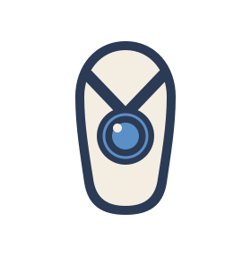
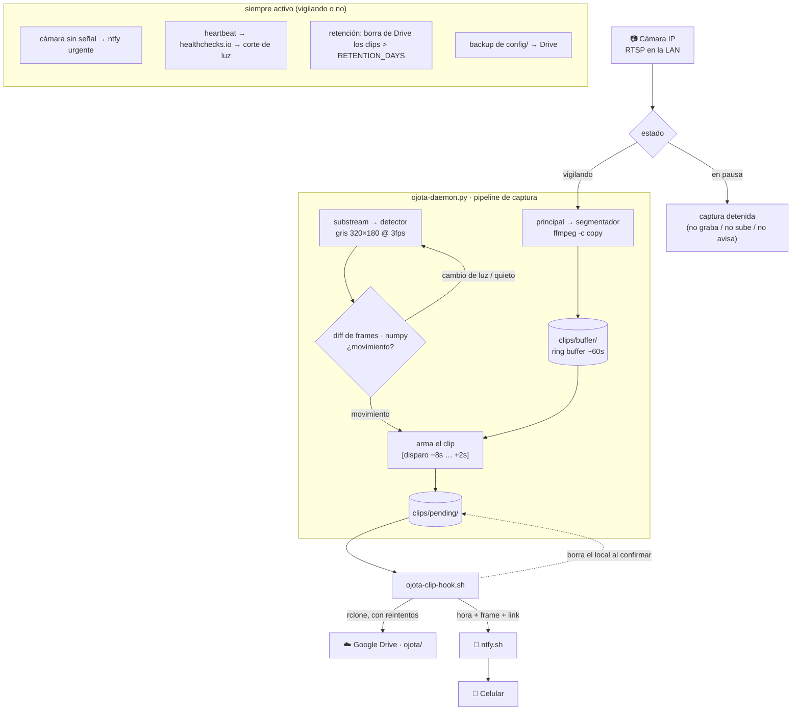

# 🩴 Ojota



Vigilancia de una cámara IP en la LAN: detecta movimiento, graba un clip con
pre-captura, lo sube a Google Drive, borra el local y avisa al celular.
Pensado para correr 24/7 en una Mac.

Alternativa casera al abono de grabación en la nube de la cámara: pre-captura,
audio y control total del pipeline.

---

## 🔍 Cómo funciona

Dos conexiones RTSP a la misma cámara, cada una con un rol. El pipeline de
captura solo corre cuando Ojota está **vigilando**; en **pausa** queda todo
detenido salvo los chequeos de salud. Se cambia con `ojota salir` /
`ojota volver`, o solo: la presencia del celu en la WiFi.



- **Vigilando / en pausa**: `ojota salir` graba, sube y avisa; `ojota
  volver` frena los dos ffmpeg y solo siguen los chequeos de salud. La
  lógica es "esto funciona cuando no estás"; si necesitás grabar estando
  en casa (alguien sospechoso en la puerta), `ojota salir` a mano.
- **El segmentador graba siempre que Ojota vigila**, haya movimiento o no.
  Por eso la pre-captura es casi gratis: el pasado ya está en disco.
- **Subida en vivo** (`LIVE_UPLOAD`): mientras vigila, el ring buffer se copia a
  `gdrive:.../live/` cada ~10 s con retención de ~3 min. Si se llevan la
  Mac o cortan la red en medio de un evento, el video está en Drive salvo
  los últimos ~10 s — no hay que esperar a que el clip se arme y suba.
  Además llega una notificación **al detectar**, no al terminar la subida.
- **La detección** corre sobre el substream en gris a 3 fps: ~2-3% de un
  núcleo. Dispara cuando N frames seguidos (`MOTION_MIN_FRAMES`) superan
  `MOTION_AREA_PCT`; un cambio de casi toda la imagen se toma como cambio
  de luz (`LIGHT_CHANGE_PCT`) y se ignora.

---

## 📦 Requisitos

- macOS (desarrollado y probado en un Mac con Intel)
- [Homebrew](https://brew.sh)
- `ffmpeg` — `brew install ffmpeg`
- `rclone` — `brew install rclone`
- Python 3.11+ (para el venv)
- Una cámara con RTSP accesible en la LAN, con IP fija o reservada por DHCP

---

## 🚀 Setup inicial

```sh
# 1. Ubicar el repo en ~/ojota
git clone https://github.com/nanotaboada/ojota.git ~/ojota && cd ~/ojota

# 2. Entorno Python aislado
python3 -m venv .venv
.venv/bin/pip install -r requirements.txt

# 3. Config con secretos (queda fuera de git)
cp config/ojota.conf.example config/ojota.conf
chmod 600 config/ojota.conf

# 4. Editar config/ojota.conf:
#    - RTSP_URL / RTSP_SUBSTREAM_URL  (usuario, pass e IP de tu cámara)
#    - NTFY_TOPIC   ->  generar uno:  echo "ojota-$(openssl rand -hex 20)"
#    - revisar el resto de parámetros (ver tabla abajo)

# 5. Probar la detección en vivo y calibrar umbrales
.venv/bin/python bin/ojota-tune.py           # pasá por delante de la cámara

# 6. Google Drive: instalar rclone y configurar el remote
brew install rclone
rclone config          # remote "gdrive", tipo drive, scope drive.file,
                       # con tu propio client_id de OAuth (ver más abajo)

# 7. Instalar como servicio 24/7
sudo bin/ojota install
sudo pmset -a sleep 0 disablesleep 1
```

### Google Drive / OAuth

Creá un client_id propio (el compartido de rclone se retira en 2026) y
**publicá la app en producción** — si queda en "Testing", el token vence
cada 7 días. Guía: <https://rclone.org/drive/#making-your-own-client-id>.
Usás el repo público como URL de home y `PRIVACY.md` como política de
privacidad. Scope `drive.file`: rclone solo toca los archivos que crea.

### Encontrar el substream de tu cámara

```sh
ffprobe -v error -rtsp_transport tcp -i "rtsp://user:pass@IP:554/PATH" \
  -show_entries stream=width,height -of csv=p=0
```

Probá rutas comunes (`/Streaming/Channels/102`, `/h264_stream2`, etc.) hasta
encontrar una de menor resolución. Si no hay, dejá `RTSP_SUBSTREAM_URL` vacío
y se usa el stream principal también para detectar.

---

## 🎛️ Configuración

Todo en `config/ojota.conf` (formato `KEY=VALUE`, lo leen bash y Python).

| Parámetro | Default | Qué hace |
|---|---|---|
| `RTSP_URL` | — | Stream principal (grabación) |
| `RTSP_SUBSTREAM_URL` | — | Stream de baja resolución (detección) |
| `DETECT_FPS` | 3 | Frames/s a analizar |
| `DETECT_WIDTH` | 320 | Ancho al que se reduce antes de comparar |
| `PIXEL_DELTA` | 18 | Cuánto (0-255) cambia un píxel para "contar" |
| `MOTION_AREA_PCT` | 1.5 | % de píxeles cambiados para disparar |
| `MOTION_MIN_FRAMES` | 3 | Frames seguidos sobre el umbral para disparar |
| `LIGHT_CHANGE_PCT` | 70 | Cambio ≥ esto = cambio de luz, se ignora |
| `DETECT_WARMUP_SECONDS` | 15 | Ignorar movimiento los primeros N s tras conectar |
| `DETECT_ROI` | `0,0,1,1` | Zona de detección (izq,arr,der,ab en fracciones). No recorta el video. |
| `LIVE_UPLOAD` | 1 | Armado: subir el ring buffer a `gdrive:.../live/` en continuo |
| `SEGMENT_SECONDS` | 4 | Tamaño de cada segmento del ring buffer |
| `PRECAPTURE_SECONDS` | 8 | Segundos antes del evento a incluir |
| `POSTCAPTURE_SECONDS` | 10 | Espera sin movimiento antes de cerrar el evento (fusiona ráfagas) |
| `BUFFER_RETENTION_SECONDS` | 60 | Historial a mantener en el ring buffer |
| `DEFAULT_PROFILE` | `armado` | Estado al bootear si no hay `config/profile` (`armado` = vigilando) |
| `NTFY_TOPIC` | — | Topic de ntfy.sh (secreto, generar aleatorio) |
| `NOTIFY_SILENCE_MINUTES` | 5 | Ventana anti-spam de notificaciones |
| `INSTANT_NOTIFY_DELAY_SECONDS` | 45 | El aviso instantáneo se difiere N s; se cancela si volvés en ese lapso |
| `CAMERA_DOWN_ALERT_MINUTES` | 5 | Alerta si la cámara no responde por N min |
| `EVENT_BURST_COUNT` / `EVENT_BURST_MINUTES` | 10 / 15 | Alerta "muchos eventos" si se acumulan |
| `RCLONE_REMOTE` / `RCLONE_PATH` | `gdrive` / `ojota` | Destino en Drive |
| `RETENTION_DAYS` | 30 | Borrar de Drive clips más viejos que esto |
| `RETENTION_CHECK_HOURS` | 24 | Cada cuánto corre la limpieza |
| `PENDING_RETRY_MINUTES` | 3 | Cada cuánto reintentar subidas que fallaron |
| `CONFIG_BACKUP` | 1 | Subir `config/` a Drive (`config-backup/`) — incluye secretos |
| `HEARTBEAT_URL` | — | Ping periódico (healthchecks.io etc.); vacío = off |
| `HEARTBEAT_MINUTES` | 15 | Cada cuánto se hace el ping |
| `PHONE_IP` | — | IP del celu para el auto-armado por presencia; vacío = off |
| `PRESENCE_POLL_SECONDS` | 10 | Cada cuánto se pinguea el celu |
| `PRESENCE_AWAY_MINUTES` | 2 | Sin ver el celu N min → Ojota vigila |
| `RETURN_GRACE_SECONDS` | 120 | Al volver, clips de estos últimos N s → `probablemente-vos/` |

---

## 🕹️ Operación

```sh
bin/ojota salir           # Ojota vigila: graba, sube y avisa   (alias: armar)
bin/ojota volver          # Ojota en pausa: solo chequeos de salud (alias: desarmar)
bin/ojota status          # estado, daemon, servicio, buffer, eventos, errores, Drive
bin/ojota start | stop | restart
bin/ojota logs [N]        # últimas N líneas del log
bin/ojota test-notify     # mandar una notificación de prueba
bin/ojota prune           # borrar de Drive los clips más viejos que RETENTION_DAYS
bin/ojota backup-config   # subir config/ a Drive (config-backup/)

# Calibrar la detección (no graba, solo muestra el % de cambio por frame)
.venv/bin/python bin/ojota-tune.py [--main] [--seconds=N]
```

`prune` y `backup-config` también corren solos desde el daemon (retención
cada `RETENTION_CHECK_HOURS`, backup al arrancar y cada 7 días).

El estado se guarda en `config/profile` (`armado` / `desarmado`); el daemon
lo toma en ~2 s. Al bootear usa lo que diga ese archivo, o `DEFAULT_PROFILE`
si no existe.

### 📶 Auto-armado por presencia del celular (recomendado)

El daemon pinguea `PHONE_IP` cada `PRESENCE_POLL_SECONDS`. Si el celu no
responde por `PRESENCE_AWAY_MINUTES` seguidos → **Ojota vigila**; cuando
vuelve a responder → **pausa** (instantánea). Un ping suelto que un celu
dormido no contesta no cuenta: alcanza con que responda uno en la ventana.

Setup: reservá la IP del celu en el router (DHCP) y ponela en `PHONE_IP`.
Cero apps en el teléfono. Sirve incluso si te quedás en el edificio
(lavadero, gimnasio) siempre que salgas del alcance de tu WiFi.

`ojota salir` a mano crea `config/manual-hold`: la presencia no lo pausa
hasta que hagas `ojota volver` (o hasta que el celu se vaya de la red).

**Al volver**, los clips de los últimos `RETURN_GRACE_SECONDS` casi seguro
sos vos entrando (el WiFi del celu tarda en reconectar): el daemon los
mueve a `gdrive:ojota/probablemente-vos/` y no notifica. No los borra —
si alguien te siguió, el clip te tiene a vos y a esa persona.

### 🗺️ Alternativa: auto-armado por geofence

Si el ping a la LAN no alcanzara (por ejemplo tu WiFi llega a la calle),
el daemon puede en cambio escuchar un topic de ntfy y una automatización
de geofence en el celular (Automate, Tasker, Atajo de iOS) le postea
`salir:TOKEN` / `volver:TOKEN`. Esa implementación se removió del daemon
por simplicidad — está en el commit `f36a673` para reincorporar.

### ⚙️ Como servicio (24/7, arranca al bootear)

```sh
sudo bin/ojota install               # instala el LaunchDaemon (nivel sistema)
sudo pmset -a sleep 0 disablesleep 1  # que la Mac no se duerma
sudo bin/ojota uninstall              # lo quita
```

Corre a nivel sistema (arranca sin login) **como root**: en macOS Sequoia,
un LaunchDaemon que baja a un usuario queda bloqueado por *Local Network
Privacy* y no puede llegar a la cámara en la LAN ("No route to host"); los
daemons de sistema que corren como root están exentos. `install` copia la
config de rclone a `config/rclone.conf` (root, 600) para no tocar la tuya
personal cuando el daemon refresca el token. Los clips y logs quedan de
root pero legibles (`umask 022`); borrarlos a mano pide sudo, la retención
automática no.

`KeepAlive` lo reinicia solo si crashea; un `stop` ordenado no lo revive.
Con el servicio instalado, `start` / `stop` / `restart` usan `launchctl`
(piden sudo).

### 🔔 Notificaciones (ntfy.sh)

Instalá la app **ntfy** en el celular, suscribite al topic de tu config
(o abrí `https://ntfy.sh/<tu-topic>` en el teléfono). Cada evento manda hora,
un frame del clip y el link directo al video en Drive. La ventana de
silencio agrupa avisos seguidos **sin afectar la grabación**. El aviso
instantáneo se difiere `INSTANT_NOTIFY_DELAY_SECONDS` y se cancela si la
presencia te reconoce en ese lapso (sos vos entrando).

Alertas de prioridad alta (aparte, sin ventana de silencio):
- la cámara deja de responder (`CAMERA_DOWN_ALERT_MINUTES`)
- se acumulan muchos eventos en poco tiempo — `EVENT_BURST_COUNT` en
  `EVENT_BURST_MINUTES` (algo raro: tormenta de falsos positivos o
  actividad sostenida en la puerta)

### 💓 Heartbeat externo (corte de luz)

La alerta de "cámara sin señal" solo llega si la Mac sigue viva y con
internet. Para enterarte de un corte que apague la Mac, creá un check en
[healthchecks.io](https://healthchecks.io) (gratis) y poné su URL de ping
en `HEARTBEAT_URL`. El daemon la llama cada `HEARTBEAT_MINUTES`; si deja de
llamar, healthchecks.io te avisa.

---

## 🩺 Diagnóstico

- **Estado general**: `bin/ojota status`.
- **Logs**: `logs/ojota.log` (daemon) y `logs/ojota-hook.log` (subidas +
  notificaciones). Ambos rotan por tamaño.
- **No detecta / detecta de más**: `ojota-tune.py`, mirar los % con y sin
  movimiento, ajustar `PIXEL_DELTA` y `MOTION_AREA_PCT`.
- **Falsos positivos por luz**: bajar `LIGHT_CHANGE_PCT` o acotar `DETECT_ROI`.
- **La cámara se cae**: el daemon reintenta con backoff exponencial y manda
  una alerta si no hay frames por `CAMERA_DOWN_ALERT_MINUTES`.
- **"No route to host" en el log del servicio**: el daemon no corre como
  root (Local Network Privacy de Sequoia). Reinstalá con `sudo bin/ojota
  install` — el plist actual ya corre como root.
- **Un clip no subió**: queda en `clips/pending/`; el daemon reintenta cada
  `PENDING_RETRY_MINUTES`. El local no se borra hasta confirmar la subida.
- **Clip cortado**: subir `POSTCAPTURE_SECONDS` / `PRECAPTURE_SECONDS`.
- **Reproducir el setup en otra Mac**: cloná el repo + bajá `config-backup/`
  de Drive a `config/` (o `rclone copy gdrive:ojota/config-backup/ config/`).

---

## 📌 Estado

Funcionando 24/7 como servicio. El auto-armado por presencia se probó con
salidas reales de hasta 2 h: reconexión del celu en ~15-20 s, sin avisos
de la propia llegada. En etapa de afinar la detección con uso real.

**Pendientes / ideas:**

- ROI para excluir zonas sin interés del encuadre (puerta del baño
  contigua).
- Validar `LIGHT_CHANGE_PCT` con luz de noche / visión nocturna IR.
- Recordatorio si Ojota queda vigilando con el celu presente hace horas
  (te olvidaste el `ojota volver`).
- Reemplazar `docs/logo.svg` (placeholder) por el logo definitivo.
